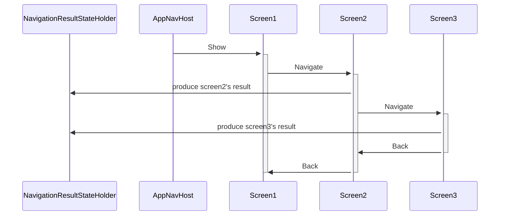
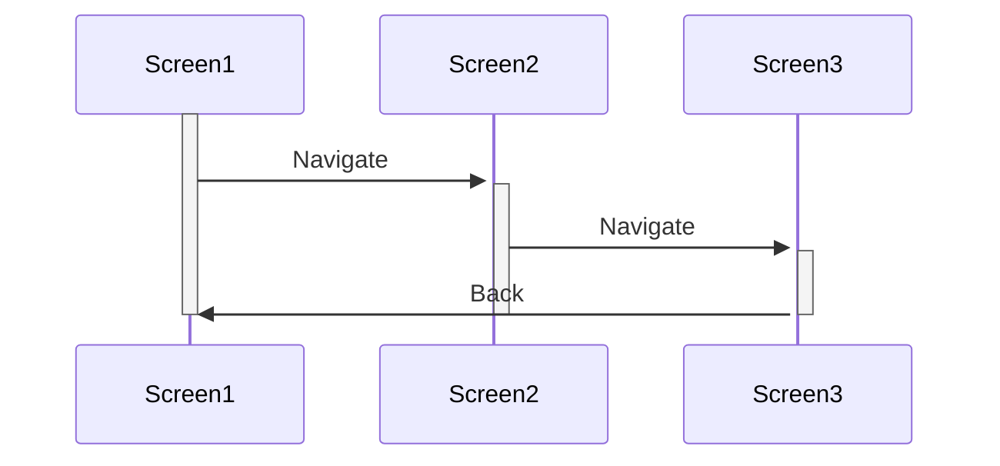

# Compose Navigation3 ResultState

ResultState provides the ability to handle screen results for Compose Navigation3.

[Compose Navigation3](https://developer.android.com/guide/navigation/navigation-3)
is a great library for navigating with stack data driven screen management, that encourages you
to achieve your feature modules become more clearly separated and independently.

However, Navigation3 lacks a Screen Result handling API at this time.
ResultState provides a Result API based on SavedState architecture for both Android Jetpack Compose and
Compose Multiplatform.

ResultState is a saveable state and remembered, so it works well even if the NavBackStack is restored from Saved State.

# Compatibility in Navigation3 alpha versions

Compose Navigation3 is still in alpha version, so use the Navigation3 version that ResultState is
compatible with.

* ResultState 1.1.0 is compatible
  with [Navigation3 1.0.0-alpha08](https://developer.android.com/jetpack/androidx/releases/navigation3#1.0.0-alpha08).

# Supporting Platforms

* Supporting all platforms that Navigation3 supports.
    * Android
    * JVM
    * Native iOS, watchOS, tvOS
    * Native macOS
    * Native Linux
    * Native Windows
    * JS, Wasm JS

# Usage

## Setup

Add ResultState dependency to your project.

### for Android Jetpack Compose project

`build.gradle.kts`

```kotlin
plugins {
    id("com.android.application")
    // ...
}

dependencies {
    // add ResultState dependency
    implementation("io.github.irgaly.navigation3.resultstate:resultstate:1.1.0")
    implementation("androidx.navigation3:navigation3-ui:...")
    // ...
}
```

### for Compose Multiplatform project

`build.gradle.kts`

```kotlin
plugins {
    kotlin("multiplatform")
    id("com.android.application")
    id("org.jetbrains.compose")
    id("org.jetbrains.kotlin.plugin.compose")
    // ...
}

kotlin {
    sourceSets {
        commonMain {
            dependencies {
                // add ResultState dependency
                implementation("io.github.irgaly.navigation3.resultstate:resultstate:1.1.0")
                implementation("org.jetbrains.androidx.navigation3:navigation3-ui:...")
            }
        }
    }
    // ...
}
```

### Using ResultState with NavDisplay

ResultState holds the all results as "String", that is for aiming to easily saved on SavedState
architecture.

* The `result key` is just a "String".
* The `result value` is just a "String".

So you can produce a result as String with a String result key.

To use ResultState, follow this steps:

1. Register the result keys to the consumer screen's NavEntry metadata with
   `NavigationResultMetadata.resultConsumer()` function.
2. Set `rememberNavigationResultNavEntryDecorator()` to NavDisplay's entryDecorators.
3. Receive the result as `State<NavigationResult?>` in the consumer screen by
   `LocalNavigationResultConsumer`.
4. Produce the result from the producer screen by `LocalNavigationResultProducer`.

Here is an example of an Android Compose project.

Compose Multiplatform project's sample is also available
in [sample/src/commonMain/kotlin/io/github/irgaly/navigation3/resultstate/sample/App.kt](sample/src/commonMain/kotlin/io/github/irgaly/navigation3/resultstate/sample/App.kt).

```kotlin
// Android Compose project sample

@Serializable
sealed interface Screen : NavKey

@Serializable
object Screen1 : Screen

@Serializable
object Screen2 : Screen

@Composable
fun NavigationContent() {
    val navBackStack = rememberNavBackStack(Screen1)
    val entryProvider = entryProvider<Screen> {
        entry<Screen1>(
            // 1.
            // Declare that the Screen1 want to receive the Screen2's result, so register "Screen2Result" key to metadata.
            // The result key is just unique string tied to the Screen2's result.
            metadata = NavigationResultMetadata.resultConsumer(
                "Screen2Result",
            )
        ) {
            Screen1(...)
        }
        entry<Screen2> {
            Screen2(...)
        }
    }
    NavDisplay(
        backStack = navBackStack,
        onBack = { ... },
        entryDecorators = listOf(
            rememberSceneSetupNavEntryDecorator(),
            // 2.
            // Set an NavigationResultNavEntryDecorator to NavDisplay.
            // This decorator provides LocalNavigationResultProducer and LocalNavigationResultConsumer to NavEntries.
            // The entryProvider must be the same one as NavDisplay's entryProvider.
            // rememberNavigationResultNavEntryDecorator() will also create NavigationResultStateHolder that holds ResultState on SavedState.
            rememberNavigationResultNavEntryDecorator(
                navBackStack = navBackStack,
                entryProvider = entryProvider,
            ),
            rememberSavedStateNavEntryDecorator(),
            rememberViewModelStoreNavEntryDecorator(),
        ),
        entryProvider = entryProvider,
    )
}
```

Next, receive the result as `State<NavigationResult?>` in Screen1.

```kotlin
@Composable
fun Screen1(...) {
    var resultString: String by rememberSaveable { mutableStateOf("{empty}") }

    // 3.
    // Receive the result as ResultState.
    val resultConsumer = LocalNavigationResultConsumer.current
    val screen2Result: NavigationResult? by remember(resultConsumer) {
        // The result key is the same one as registered in Screen1's metadata.
        resultConsumer.getResultState("Screen2Result")
    }
    LaunchedEffect(screen2Result) {
        val result: NavigationResult? = screen2Result
        if (result != null) {
            // NavigationResult.result is just a String.
            resultString = result.result
            // Clear the result after received to avoid receiving it in next composition.
            // Here, result.resultKey is "Screen2Result".
            resultConsumer.clearResult(result.resultKey)
        }
    }
    Column {
        Text("Screen1")
        Text("Received result is: $resultString")
    }
}
```

Finally, produce the result from Screen2.

```kotlin
@Composable
fun Screen2(...) {
    val resultProducer = LocalNavigationResultProducer.current
    Column {
        Text("Screen2")
        Button(onClick = {
            // 4.
            // Produce the result for "Screen2Result" key.
            // The result key and value are just a String.
            resultProducer.setResult(
                "Screen2Result",
                "my result of screen2!",
            )
        }) {
            Text("Set a result to \"Screen2Result\" key")
        }
    }
}
```

That's all!

You can receive the Screen2's result "my result of screen2!" from Screen1, when reentered to Screen1
or realtime because of the result is observed by Screen1 as a State.

### Using ResultState with typed result keys and Kotlinx Serialization

ResultState supports to handle the typed result keys and the value as any Serializable type.
Serialization support is provided by extension functions.

Here is an example.

```kotlin
// Declare a serializable result data class.
@Serializable
data class Screen2Result(val result: String)

// Define Screen2's result key as SerializableNavigationResultKey's instance,
// The resultKey is "Screen2Result", and the result type is Screen2Result.
val Screen2ResultKey = SerializableNavigationResultKey<Screen2Result>(
    serializer = Screen2Result.serializer(),
    resultKey = "Screen2Result",
)

@Composable
fun NavigationContent() {
    val navBackStack = rememberNavBackStack(Screen1)
    val entryProvider = entryProvider<Screen> {
        entry<Screen1>(
            metadata = NavigationResultMetadata.resultConsumer(
                // Register Screen2ResultKey as typed key.
                Screen2ResultKey
            )
        ) {
            Screen1(...)
        }
        entry<Screen2> {
            Screen2(...)
        }
    }
    NavDisplay(
        backStack = navBackStack,
        onBack = { ... },
        entryDecorators = listOf(
            rememberSceneSetupNavEntryDecorator(),
            rememberNavigationResultNavEntryDecorator(
                navBackStack = navBackStack,
                entryProvider = entryProvider,
            ),
            rememberSavedStateNavEntryDecorator(),
            rememberViewModelStoreNavEntryDecorator(),
        ),
        entryProvider = entryProvider,
    )
}

@Composable
fun Screen1(...) {
    // Use the same Json configuration as Producer side.
    // Here, just use a default Json instance for example.
    val json: Json = Json
    val resultConsumer = LocalNavigationResultConsumer.current
    var resultString: String by rememberSaveable { mutableStateOf("{empty}") }
    val screen2Result: SerializedNavigationResult<Screen2Result>? by remember(resultConsumer) {
        // Pass the json instance and typed key.
        resultConsumer.getResultState(json, Screen2ResultKey)
    }
    LaunchedEffect(screen2Result) {
        val result: SerializedNavigationResult<Screen2Result>? = screen2Result
        if (result != null) {
            // The received result is just a String, but getResult() will decode it to a Screen2Result instance.
            val screen2Result: Screen2Result = result.getResult()
            resultConsumer.clearResult(result.resultKey)
        }
    }
    Column {
        Text("Screen1")
        Text("Received result is: $resultString")
    }
}

@Composable
fun Screen2(...) {
    // Use the same Json configuration as Consumer side.
    // Here, just use a default Json instance for example.
    val json: Json = Json
    val resultProducer = LocalNavigationResultProducer.current
    Column {
        Text("Screen2")
        Button(onClick = {
            // Pass the json instance, the typed key, and the result instance.
            resultProducer.setResult(
                json,
                Screen2ResultKey,
                Screen2Result("my result of screen2!"),
            )
        }) {
            Text("Set a result to Screen2ResultKey")
        }
    }
}
```

# Architecture

ResultState will store all results in a `MutableState<Map<String, Map<String, String>>>`,
that is defined in rememberNavigationResultNavEntryDecorator() or
rememberNavigationResultStateHolder() and it is held by NavigationResultStateHolder.

This map contains all values as String, so it can be saved by SavedState.

```kotlin
@Composable
fun <T : Any> rememberNavigationResultNavEntryDecorator(
    navBackStack: SnapshotStateList<T>,
    entryProvider: (T) -> NavEntry<*>,
    contentKeyToString: (Any) -> String = { it.toString() },
    savedStateResults: MutableState<Map<String, Map<String, String>>> = rememberSaveable {
        mutableStateOf(emptyMap())
    },
): NavEntryDecorator<T> {
    val navigationResultStateHolder = rememberNavigationResultStateHolder(
        navBackStack = navBackStack,
        entryProvider = entryProvider,
        contentKeyToString = contentKeyToString,
        savedStateResults = savedStateResults,
    )
    return remember(navigationResultStateHolder) {
        NavigationResultNavEntryDecorator(navigationResultStateHolder)
    }
}
```

The map has the structure below:

* `Map<String, Map<String, String>>`
    * Key: NavEntry contentKey as String
    * Value: `Map<String, String>`
        * Key: a Result Key as String
        * Value: a Result as String

So all consumer screens can store the result map on SavedState.

## Any screens can receive the result

ResultState provides the result to all screens that registered as a consumer by NavEntry's metadata,
so any multiple screens and any position at NavBackStack can consume the result.

This means:

* Assume that:
    * The NavBackStack is [Screen1, Screen2, Screen3].
* Then, they are all possible:
    * Screen1 receives Screen2's result.
    * Screen1 receives Screen3's result.
    * Screen2 receives Screen3's result.
    * Screen3 receives Screen3's result.

## An example of ResultState lifecycle

The map's contents are associated with NavEntry's lifecycle.

Here is a state's lifecycle example:

* For example, assume that:
    * Screen1's contentKey is `"screen1"`.
    * Screen2's contentKey is `"screen2"`.
    * Screen3's contentKey is `"screen3"`.
  * Screen1 is a consumer of `"Screen2Result"` key and `"Screen3Result"` key.
    * Screen2 is a consumer of `"Screen3Result"` key.

The scenario is as follows:



### 1. Initial state

The initial state of ResultState map is empty:

| Map Key | Map Value |
|---------|-----------|
| (empty) | (empty)   |

### 2. Navigated to Screen2, then Screen2 produce a result

Screen2 produced a result `"result from screen2"` for `"Screen2Result"` key.

The current ResultState map is:

| Map Key     | Map Value                                    |
|-------------|----------------------------------------------|
| `"screen1"` | `"Screen2Result"` to `"result from screen2"` |

### 3. Navigated to Screen3, then Screen3 produces a result

Screen3 produced a result `"result from screen3"` for `"Screen3Result"` key.

The current ResultState map is:

| Map Key     | Map Value                                                                                     |
|-------------|-----------------------------------------------------------------------------------------------|
| `"screen1"` | `"Screen2Result"` to `"result from screen2"`<br/>`"Screen3Result"` to `"result from screen3"` |
| `"screen2"` | `"Screen3Result"` to `"result from screen3"`                                                  |

### 4. Navigated back to Screen2

Navigated back to Screen2, and Screen3 was popped out from the NavBackStack.

Screen3 holds no result in the ResultState map, so the map is not changed.

The current ResultState map is:

| Map Key     | Map Value                                                                                     |
|-------------|-----------------------------------------------------------------------------------------------|
| `"screen1"` | `"Screen2Result"` to `"result from screen2"`<br/>`"Screen3Result"` to `"result from screen3"` |
| `"screen2"` | `"Screen3Result"` to `"result from screen3"`                                                  |

Then, Screen2 has consumed the `"Screen3Result"` result, and called
`consumer.clearResult("Screen3Result")`.

So the ResultState map is:

| Map Key     | Map Value                                                                                     |
|-------------|-----------------------------------------------------------------------------------------------|
| `"screen1"` | `"Screen2Result"` to `"result from screen2"`<br/>`"Screen3Result"` to `"result from screen3"` |

### 5. Navigated back to Screen1

Navigated back to Screen1, and Screen2 was popped out from the NavBackStack.

Screen2 holds no result in the ResultState map, so the map is not changed.

The current ResultState map is:

| Map Key     | Map Value                                                                                     |
|-------------|-----------------------------------------------------------------------------------------------|
| `"screen1"` | `"Screen2Result"` to `"result from screen2"`<br/>`"Screen3Result"` to `"result from screen3"` |

Then, Screen1 has consumed the `"Screen2Result"` result and `"Screen3Result"` result, then called
`consumer.clearResult("Screen3Result")`, `consumer.clearResult("Screen3Result")`.

So the ResultState map is:

| Map Key | Map Value |
|---------|-----------|
| (empty) | (empty)   |

## The results are cleared when the consumer screen is popped out

When it is navigated to Screen1 from Screen3 by skipping Screen2 showing, Screen2 can not consume
the
`"Screen3Result"` result.

The ResultState map is associated with NavEntry's lifecycle, so the results that the Screen2 holds
are cleared automatically.



The Screen3 has showed and produced a result `"result from screen3"` to `"Screen3Result"` key.

The current ResultState map is:

| Map Key     | Map Value                                                                                     |
|-------------|-----------------------------------------------------------------------------------------------|
| `"screen1"` | `"Screen2Result"` to `"result from screen2"`<br/>`"Screen3Result"` to `"result from screen3"` |
| `"screen2"` | `"Screen3Result"` to `"result from screen3"`                                                  |

Then, it navigated back to Screen1 from Screen3 directly, while the Screen2 was also popped out.

Screen2 did not consume the `"Screen3Result"` result, but the results for `"screen2"` are cleared
automatically.

Then current ResultState map is:

| Map Key     | Map Value                                                                                     |
|-------------|-----------------------------------------------------------------------------------------------|
| `"screen1"` | `"Screen2Result"` to `"result from screen2"`<br/>`"Screen3Result"` to `"result from screen3"` |

## ResultState supports multi-pane SceneStrategy

ResultState provides the results as observable State, so the produced results are consumed in
realtime while the consumer screen is showing.

For example, Screen1 and Screen2 are both showing in a multi-pane SceneStrategy, and Screen2
produces a result, then Screen1 can consume the result in realtime by
`LaunchedEffect(resultState) { ... }`.
